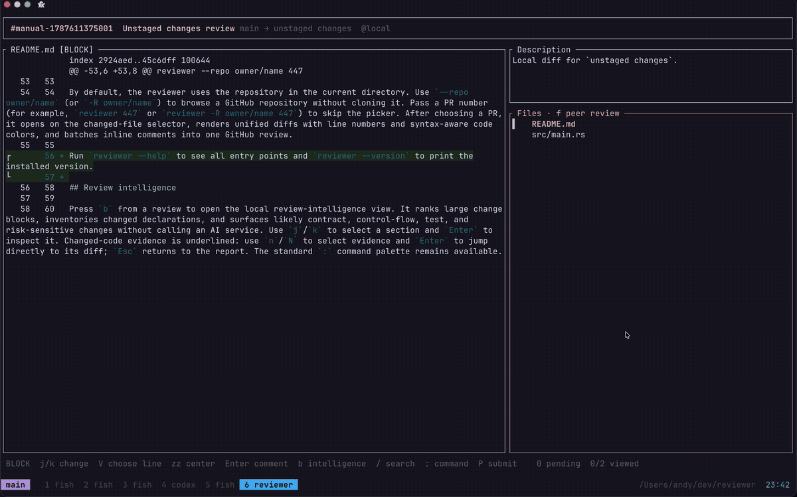

# Critter 🐛

Give every diff a second look. 👀

Critter brings GitHub's familiar review flow to a fast, keyboard-driven TUI: read diffs, leave inline comments, and submit a review. It also works as a review loop for coding agents—launch Critter, write your feedback, and send it straight back to the agent for another pass.



## 📦 Install

You need [Rust](https://www.rust-lang.org/tools/install), the [GitHub CLI](https://cli.github.com/), and an authenticated GitHub session (`gh auth login`).

```sh
cargo install --git https://github.com/andyhmltn/reviewer
```

Critter uses `nvim` to open files by default. Set `$EDITOR` to use something else.

## 🔍 Review a pull request

```sh
# Pick a PR from the current repository
reviewer

# Open a PR directly
reviewer 447

# Review a repository without cloning it
reviewer -R owner/repo 447
```

Comments stay local until you submit. Press `P` to approve, request changes, or leave a comment.

## 🤖 Review with an agent

Run Critter from the agent's tmux session and wait for the submitted feedback:

```sh
# Review the current branch's PR, including uncommitted work
reviewer pr-tmux --wait

# Review the local working tree before a PR exists
reviewer local-tmux --wait
```

The command prints your review as a ready-to-use prompt, so the agent can apply the comments and run the loop again. Nothing is posted to GitHub.

To narrow a local review:

```sh
reviewer pr-tmux --wait --unstaged
reviewer pr-tmux --wait --last-commit
reviewer local-tmux --wait --base main
```

The bundled Codex plugin exposes the same flow as `$local-review`.

To start a review without spending a Codex turn on the plugin, add a tmux popup
binding. When you submit the review, Critter pastes the complete feedback into
the originating Codex chat and presses Enter. Quitting without submitting does
nothing.

```tmux
# Review unstaged tracked changes with prefix + R.
bind-key R display-popup -E -w 90% -h 90% \
  'reviewer codex-tmux --unstaged'
```

Use `reviewer codex-tmux --last-commit` for the last commit, or omit the scope
flag to review the current branch pull request.

## ⌨️ Keys

| Key | Action |
| --- | --- |
| `j` / `k` | Move between files, change blocks, or lines |
| `h` / `l` | Previous / next file |
| `Enter` | Open or comment |
| `V` | Select individual lines |
| `/` | Search changed lines |
| `n` / `N` | Next / previous search result |
| `v` | Mark file viewed |
| `o` | Open the current line in `$EDITOR` |
| `c` | View pending comments |
| `P` | Submit or hand off the review |
| `b` | Open review intelligence |
| `<Space>l` | Toggle the file sidebar |
| `:` | Open the command palette |
| `Esc` | Go back |
| `q` | Quit |

## 🧠 More

Critter can also run a deeper background review through `pi`:

```sh
reviewer peer-review -R owner/repo 42
reviewer peer-review-status -R owner/repo 42
```

It never starts an AI review automatically. Results are cached locally and appear inside the TUI.

Run `reviewer --help` for every command and `reviewer --version` for the installed version.

### gh-dash

Add Critter as a [`gh-dash`](https://github.com/dlvhdr/gh-dash) keybinding:

```yaml
- key: R
  name: review
  command: reviewer {{.PrNumber}}
```
